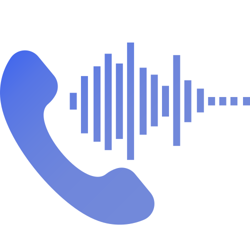

# MSP Voice Portal

[](https://www.php.net/)
[](https://getbootstrap.com/)
[](https://developer.mozilla.org/en-US/docs/Web/JavaScript)
[](https://developer.mozilla.org/en-US/docs/Web/HTML)
[](https://developer.mozilla.org/en-US/docs/Web/CSS)
[](https://fontawesome.com/)

A secure, modern and mobile friendly web application for IT MSP (Managed Service Provider) companies to collect audio recordings and text submissions from customers for their managed VoIP solutions. This portal allows customers to easily submit voice recordings, audio files, or text content related to their VoIP service requests.

<details>
  <summary>Preview</summary>
  
</details>

## Features

- Multiple input methods (audio recording, file upload, text)
- Configurable max recording duration with user warnings
- Secure file handling and validation
- Email notifications
- Multi-language support
- User-friendly interface
- Mobile-responsive design
- Configurable security settings
- Rate limiting protection
- CSRF protection
- Comprehensive error handling
- Easy theming or styling to the MSP needs (e.g., logo, colors)

## Readme Index

- [Installation](#installation)
- [Supported File Types](#supported-file-types)
- [Customer Usage](#customer-usage)
- [Contributing](#contributing)
- [Multi-language Support](#multi-language-support)
- [Changelog](CHANGELOG.md)
- [TODO List](#todo-list)
- [Author](#author)
- [License](#license)

## Installation

For detailed installation instructions, please refer to the [INSTALL.md](INSTALL.md) guide.

## Supported File Types

The application supports the following audio file formats:

### File Upload and Audio Recording
- **WAV** - Waveform Audio File Format
  - MIME types: `audio/wav`, `audio/wave`, `audio/x-wav`, `audio/x-pn-wav`, `audio/vnd.wave`
  - File header validation (RIFF header)
- **MP3** - MPEG Audio Layer III
  - MIME types: `audio/mpeg`, `application/octet-stream`
- **MP4** - MPEG-4 Audio
  - MIME types: `audio/mp4`
- **WebM** - Web Media Audio
  - MIME types: `audio/webm`, `video/webm`
- **OGG** - Ogg Vorbis Audio
  - MIME types: `audio/ogg`
  - File header validation (OggS header)
- **AAC** - Advanced Audio Coding
  - MIME types: `audio/aac`, `audio/aacp`
  - File header validation (ADTS header)
- **M4A** - MPEG-4 Audio (standalone)
  - MIME types: `audio/x-m4a`, `audio/mp4a-latm`
  - File header validation (ftyp header)

### File Validation
- MIME type verification using PHP's `finfo`
- File header validation for WAV, OGG, M4A, and AAC files
- File extension fallback validation
- Size limit enforcement
- Secure file naming with random prefixes

## Customer Usage

1. Access the web interface
2. Choose input method:
   - Record audio directly
   - Upload audio file
   - Enter text
3. Fill in required information:
   - Company name
   - Contact email
   - Contact phone
   - Notes
4. Select severity level
5. Submit the form

## Contributing

We welcome contributions from the community! Feel free to contribute to this project in any of the following ways:

### Report Issues
Found a bug or have a suggestion? Please [open an issue](https://github.com/Monstertov/msp-voice-portal/issues) and let us know! We appreciate detailed bug reports and feature requests.

### Suggest Improvements
Have an idea for a new feature or improvement? We'd love to hear about it! Open an issue with the "enhancement" label and describe your suggestion.

### Improve Documentation
Documentation improvements are always welcome! Whether it's fixing typos, clarifying instructions, or adding examples, every bit helps.

### Help with Translations
See [here](#multi-language-support)

## Multi-language Support

Currently supported languages:
- English (🇬🇧)
- Dutch (🇳🇱)

To add a new language:
1. Add translations to `assets/js/languages.js`
2. Add language flag to the language switcher in `index.php`
3. Add translations for error messages in `process.php`

Example language addition:
```javascript
// In assets/js/languages.js
const translations = {
    'fr': {
        'submit': 'Soumettre',
        'recordAudio': 'Enregistrer l'audio',
        // ... more translations
    }
};
```

```html
<!-- In index.php language switcher -->
<button type="button" data-lang="fr">
    
</button>
```

## TODO List

- [ ] Get a demo up and running

### Features
- [ ] Multiple file/recording upload support
- [x] Additional file format support (OGG, M4A, etc.)
- [x] Contact support integration in error messages
- [x] Clickable mailto link for support contact in disclaimer
- [x] Drag & drop upload
- [x] Configurable primary color accent in the config file
- [x] Remember company name/email from previous submissions
- [x] Play back recordings before submission
- [ ] ElevenLabs integration
- [ ] Custom style audio playback 

### Technical Improvements
- [x] Configurable max recording duration with warnings
- [x] Add file format validation for new formats
- [ ] Implement multi-file upload handling (split in multiple e-mails)
- [x] Add MSP support contact configuration in config.php
- [ ] File compression

### Browser Testing
- [ ] iOS Chrome/Safari testing
- [ ] macOS Chrome/Safari testing
- [ ] Edge browser testing
- [ ] Cross-browser compatibility verification

## Author

Monstertov

## License

MIT License

Copyright (c) Monstertov

Permission is hereby granted, free of charge, to any person obtaining a copy
of this software and associated documentation files (the "Software"), to deal
in the Software without restriction, including without limitation the rights
to use, copy, modify, merge, publish, distribute, sublicense, and/or sell
copies of the Software, and to permit persons to whom the Software is
furnished to do so, subject to the following conditions:

The above copyright notice and this permission notice shall be included in all
copies or substantial portions of the Software.

THE SOFTWARE IS PROVIDED "AS IS", WITHOUT WARRANTY OF ANY KIND, EXPRESS OR
IMPLIED, INCLUDING BUT NOT LIMITED TO THE WARRANTIES OF MERCHANTABILITY,
FITNESS FOR A PARTICULAR PURPOSE AND NONINFRINGEMENT. IN NO EVENT SHALL THE
AUTHORS OR COPYRIGHT HOLDERS BE LIABLE FOR ANY CLAIM, DAMAGES OR OTHER
LIABILITY, WHETHER IN AN ACTION OF CONTRACT, TORT OR OTHERWISE, ARISING FROM,
OUT OF OR IN CONNECTION WITH THE SOFTWARE OR THE USE OR OTHER DEALINGS IN THE
SOFTWARE.